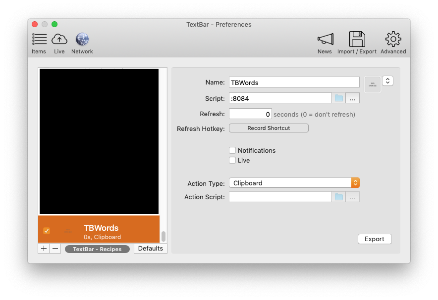

# TBWords

Simple app to read words from STDIN and send them to a listener in TextBar.

## Instuctions:

### 1. Create a Listener in TextBar



(Use Port 8084, unless you specify a different Port in TBWords)

### 2. Download TBWords

[](https://github.com/richie5um/TBWords/releases)

### 3. Run TBWords with your text file

```
./TBWords < myfile.txt
```

> You can specify different port / speed like this:

```
./TBWords --port=8081 --sleep=500 < myfile.txt
```

#### 4 Done :)
